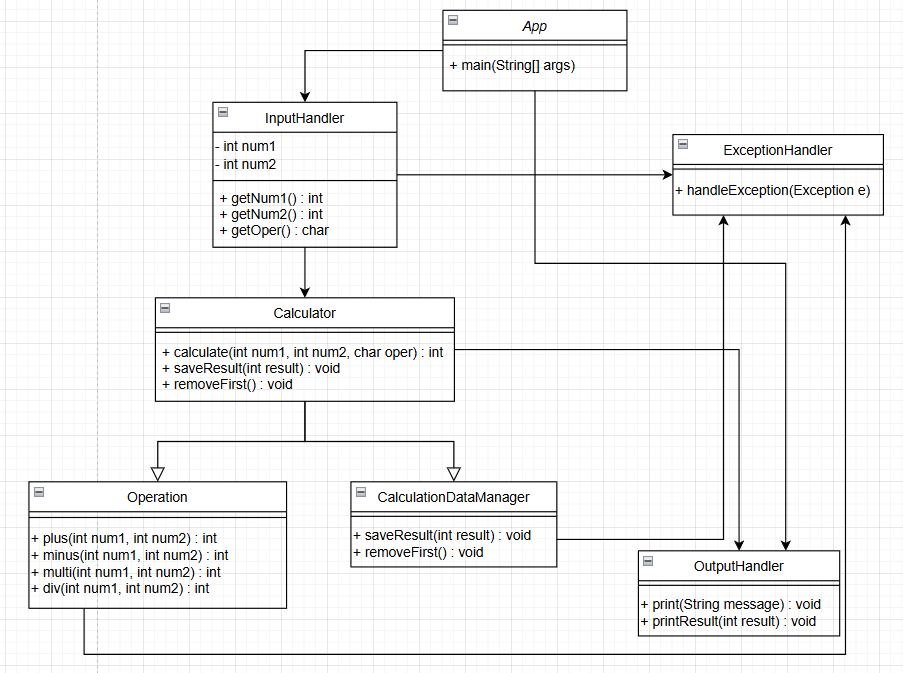

# Calculator

---
## Lv 1. 클래스 없이 기본적인 연산을 수행할 수 있는 계산기 만들기

### Requirement

#### Definition
- [x] 양의 정수(0 포함)입력 받기
  - [x] Scanner 사용 양의 정수 2개 입력 받기
  - [x] 양의 정수는 각각 하나씩 입력
  - [x] 적합합 타입으로 선언한 변수에 저장


- [x] 사칙 연산 기호 입력 받기
  - [x] Scanner 사용 사칙 연산 기호 입력 받기
  - [x] 사칙 연산 기호를 적합한 타입으로 선언한 변수에 저장


- [x] 위에서 입력받은 양의 정수 2개와 사칙연산 기호를 사용하여 연산을 진행한 후 결과값을 출력하기
  - [x] 사칙연산 기호에 맞는 연산자 사용하여 연산 진행
  - [x] 입력 받은 연산 기호 구분 위해 제어문 사용


- [x] 반복문 사용 시, exit 문자열 입력 전 까지 반복


- [x] 오류 발생 시, 적절히 처리 후 출력
  - [x] 양의 정수를 제외한 입력 발생
  - [x] 사칙 연산 기호를 제외한 입력 발생
  - [x] 연산 오류 발생
    - [x] 나눗셈 연산에서 분모에 0이 들어가는 경우

#### Design (Pseudocode)
```
while(true){
            Get 2 Integer a, b
            if(2 Integer < 0){
                negativeIntegerExpection
            }

            Get Operation
            if(Operation is not in ('+','-','/','*')){
                notOperationException
            }

            switch(Operation){
                case '+':
                    Print a + b
                case '-':
                    Print a - b
                case '*':
                    Print a * b
                case '/':
                    if(b is 0){
                        denominatorIsZeroException
                    }
                    Print a / b
            }
            
            Get operationAgain
            if(operationAgain is 'exit')
                finish
        }
```

---
## Lv 2. 클래스를 적용해 기본적인 연산을 수행할 수 있는 계산기 만들기

### Requirement

#### Definition

- [ ] 사칙연산 수행 후, 결과값 반환 method 구현
- [ ] 연산 결과 저장하는 Collection 타입 필드를 가진 Calculator 클래스 생성


- [ ] Lv 1에서 구현한 Main method에 Calculator 클래스가 활용 될 수 있도록 수정
  - [ ] 연산 수행 역할 : Calculator 클래스
  - [ ] 연산 결과 : Calculator 클래스의 Collection 타입 필드에 저장


- [ ] App 클래스의 Main method에서 Calculator 클래스의 연산 결과를 저장하고 있는 Collection 필드에 직접 접근 하지 못하게 캡슐화
  - [ ] 간접 접근을 통해 가져올 수 있도록 구현(Getter)
  - [ ] 간접 접근을 통해 수정할 수 있도록 구현(Setter)


- [ ] Calculator 클래스에 저장된 연산 결과들 중 가장 먼저 저장된 데이터를 삭제하는 기능
  - [ ] App 클래스의 Main method에서 삭제 method가 활용 될 수 있도록 수정


##### Class Configuration

app
- [ ] App : 메인 실행 클래스

input
- [ ] InputHandler : 사용자 입력 처리

calculator
- [ ] Calculator extends Operation, implements HistoryManager : 연산 수행 및 결과 저장
- [ ] Operation : 사칙 연산 수행 method
- [ ] CalculationDataManager : 계산 결과 관리

exception
- [ ] ExceptionHandler : Exception 저장 및 알맞게 출력

output
- [ ] OutputHandler : 콘솔에 알맞게 출력

#### Design

##### Class Diagram



---
## Lv 3. Enum, 제네릭, 람다 & 스트림을 이해한 계산기 만들기

### Requirement

#### Definition

#### Design


---
## Commit Convention

### 형식

```
type(scope) : short summary

[body]

[footer]
```

<br>type : 커밋의 목적
<br>scope : 변경된 코드의 범위
<br>short summary : 커밋의 간략한 설명
<br>body : 커밋의 자세한 설명
<br>footer : 부가 정보

### type

<br>feat: 새로운 기능 추가.
<br>fix: 버그 수정.
<br>docs: 문서 수정 (README.md, 주석 등).
<br>style: 코드 포맷팅, 세미콜론 누락 등 기능에 영향을 미치지 않는 변경.
<br>refactor: 코드 리팩토링 (기능 변화 없음).
<br>test: 테스트 코드 추가/수정.
<br>chore: 빌드 프로세스 또는 패키지 매니저 설정 수정.
<br>perf: 성능 개선을 위한 변경.
<br>ci: CI 설정 변경.
<br>build: 빌드 관련 파일 변경.

✨ : feat
<br>🐛 : fix
<br>📝 : docs
<br>🎨 : style
<br>🔨 : refactor
<br>🚀 : perf
<br>✅ : test
<br>📦 : chore
<br>🗑️ : delete
---

## Code Convention

<br>class name : PascalCase(ex: MyClass)
<br>method and var : camelCase(ex: userName)
<br>const : UPPER_SNAKE_CASE(ex: MAX_LENGTH)

class : 명사형
<br>interface : 형용사 or 명사형
<br>method : 동사형
<br>var : 명사형, 의미 알수 있도록 명확히
<br>들여 쓰기 : 4칸
<br>중괄호 : 한 줄 아래에서 시작
<br>공백 : 연산자, 피연산자 사이에 공백 사용 ex : total = price + tax; / calculateTotal(price, tax);

주석 : 가능하면 JavaDoc 형식 사용

코드 : 클래스 내부 코드는 const, field, constructor, method 순으로 작성

---

### Class Diagram 작성법

#### 클래스 표기

+: public
<br> -: private
<br> #: protected
<br> (공백) : default

#### Association
정확히 하나 : 1
<br> 0 or 1 : 0..1
<br> 0개 이상 : 0..
<br> 1개 이상 : 1..*
<br> 정확한 숫자 : 3..4 or 6
<br> 복잡한 관계 : 0..1, 3..4, 6.* -> 2,5 이외의 수 의미

#### Relation

Interface : << >>
<br> Abstract : Italic
<br> Dependency : 점선
<br> Association : 실선
<br> Inheritance : 속이 빈 화살표를 가진 실선
<br> Realization : 속이 빈 화살표를 가진 점선
<br> Aggregation : 속이 빈 마름모를 가진 실선
<br> Composition : 속이 찬 마름모를 가진 실선